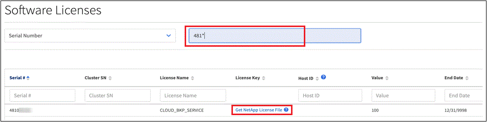

= 
:allow-uri-read: 

BlueXP 에 인터넷 액세스 권한이 없는 경우(개인 모드 설치) 업로드할 NetApp 라이센스 파일을 얻어야 합니다.

NetApp 영업 담당자로부터 라이선스를 구입하면 NetApp에서 일련 번호와 추가 라이선스 세부 정보가 포함된 전자 메일을 보냅니다. 라이선스가 자동으로 표시되지 않는 경우 해당 라이선스 파일을 얻으려면 해당 일련 번호가 필요합니다.

.단계
. BlueXP  계정 ID 찾기:
+
.. BlueXP  콘솔의 오른쪽 위에서> * ID 및 액세스 관리 * 를 선택합니다image:icon-settings-option.png["BlueXP  웹 콘솔의 오른쪽 상단에 표시되는 설정 아이콘입니다."].
.. 조직 페이지에서 계정 ID를 찾아 복사합니다.
+
나열된 계정 ID가 없고 조직 ID만 있는 경우 조직 ID의 처음 8개 문자를 복사하여 _account-_에 추가해야 합니다

+
예를 들어 다음과 같이 조직 ID라고 가정해 보겠습니다.

+
ea10e1c6-80cc-4219-8e99-3c3e6b161ba5

+
계정 ID는 다음과 같습니다.

+
계정 - ea10e1c6

. 에 로그인합니다 https://mysupport.netapp.com["NetApp Support 사이트"^] 시스템 > 소프트웨어 라이센스 * 를 선택합니다.
. 사용권의 일련 번호를 입력합니다.
+

. 라이센스 키 * 열에서 * NetApp 라이센스 파일 가져오기 * 를 선택합니다.
. BlueXP  계정 ID(지원 사이트에서 테넌트 ID라고 함)를 입력하고 * 제출 * 을 선택하여 라이센스 파일을 다운로드합니다.
+
image:../media/screenshot_cloud_backup_license_step2.gif["테넌트 ID를 입력한 다음 제출을 선택하여 라이센스 파일을 다운로드할 수 있는 라이센스 가져오기 대화 상자가 표시된 스크린샷"]

